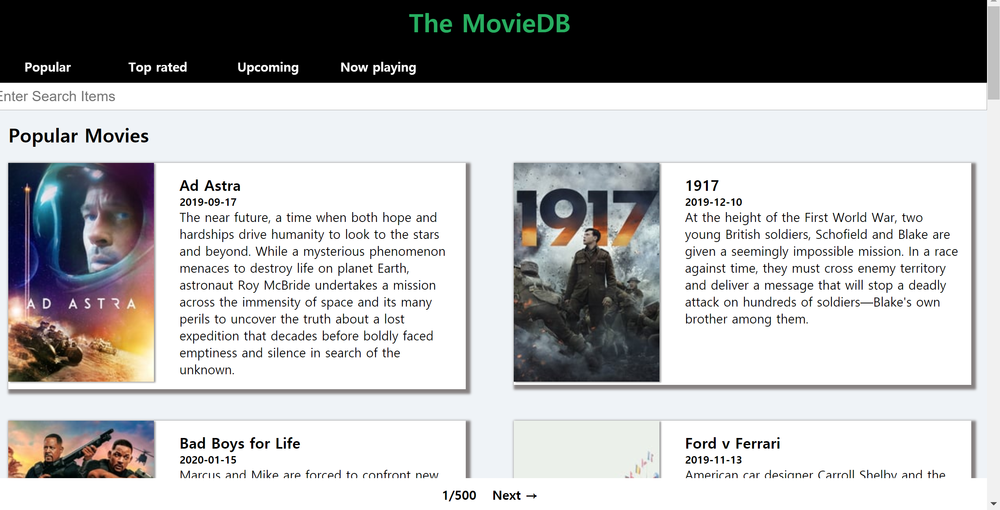

This web application is for showing movie list from TMDB by using ReactJS.
You can get your own api from https://developers.themoviedb.org/4/getting-started

What I learned from making project,
1. Component life cycle
2. Class component and state
3. Axios and using awaite
4. react-router-dom

Screenshots
-----------

Reference
-------------
https://www.youtube.com/watch?v=bqSSLr8A8PU
https://academy.nomadcoders.co/courses/216871/lectures/12913620
